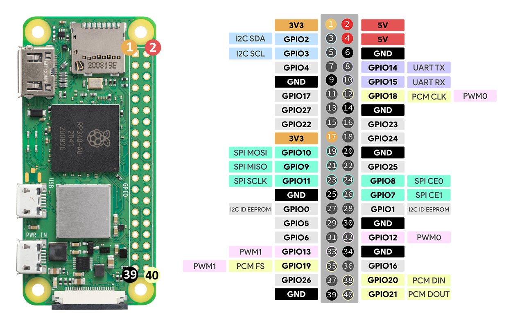

# dulap-rdm6300

https://github.com/mad-tinkerer/python-rdm6300

Connected the RDM6300 with a USB RS232 TTL converter.

# Installation
## 📌 Installing dependencies
```sh
sudo apt install python3-pip samba samba-common-bin
sudo rm /usr/lib/python3.11/EXTERNALLY-MANAGED
python3 -m pip install pyserial
```

## 📌 Samba share
```sh
sudo nano /etc/samba/smb.conf
```

### `/etc/samba/smb.conf`
```sh
[rpi0fetdulap]
path = /home/pi
writeable=Yes
create mask=0777
directory mask=0777
public=no
```

```sh
sudo smbpasswd -a pi
```

```sh
sudo systemctl restart smbd
```

## 📌 Service
```sh
sudo cp ~/dulap-rdm6300/rdm6300.service /etc/systemd/system/
sudo systemctl enable rdm6300.service
sudo systemctl start rdm6300.service
```

# Wiring
- ### Active Buzzer Module
    | RPi Pin     | Buzzer |
    | ----------- | ------ |
    | 1 (3V3)     | VCC    |
    | 9 (GND)     | GND    |
    | 11 (GPIO**17**) | I/O    |

- ### Relay Boards
    | RPi Pin         | Relay Modules |
    | --------------- | ------------- |
    | 2 (5V)          | VCC1          |
    | 4 (5V)          | VCC2          |
    | 6 (GND)         | GND2          |
    | 14 (GND)        | GND1          |
    | 37 (GPIO**26**) | IN1           |
    | 35 (GPIO**19**) | IN2           |
    | 33 (GPIO**13**) | IN3           |
    | 31 (GPIO**6**)  | IN4           |
    | 29 (GPIO**5**)  | IN5           |
    | 23 (GPIO**11**) | IN6           |
    | 21 (GPIO**9**)  | IN7           |
    | 19 (GPIO**10**) | IN8           |
    | 15 (GPIO**22**) | IN9           |
    | 40 (GPIO**21**) | IN10          |
    | 38 (GPIO**20**) | IN11          |
    | 36 (GPIO**16**) | IN12          |

- ### RDM6300 with USB TTL
    | RDM6300 | USB TTL |
    | ------- | ------- |
    | 5V      | VCC     |
    | GND     | GND     |
    | RX      | TX      |
    | TX      | RX      |

# Raspberry Pi Zero 2 W Pinout


# RDM6300
https://electropeak.com/learn/wp-content/uploads/2021/02/RDM6300-125KHz-RFID-Pinout1.jpg
